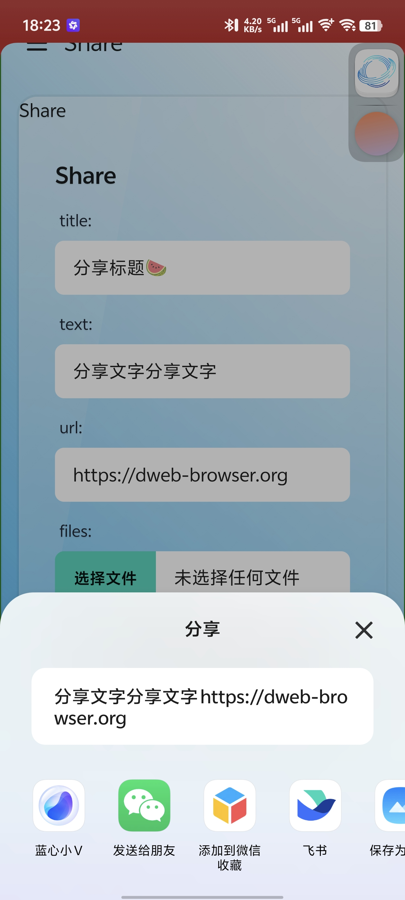

<article class="page">

<h1 class="center">自由穿梭软件说明书</h1>
</article>

## 1. 入口界面

1. 在完成用户许可的同意后，进入到应用
   
1. 可以看到，应用是以一种“桌面”的形式来展示功能：
   
   1. 顶部是一个搜索的入口
   1. 下方是一些应用功能入口

## 2. “网页浏览器”功能

1. 点击“桌面”上的“浏览器”，可以进入到 网页浏览器 功能的主页界面，这是一个导航页面，它提供了一些网页浏览器相关的功能入口
   
1. 点击底部的“输入框”，可以打开“搜索面板”，在这里，可以输入网址或者搜索关键词
   
   
   1. 无需 https 协议头，能够自动识别
1. 点击搜索面板中的搜索引擎，即可使用该搜索引擎进行搜索
   
1. 点击网页底部的“地址栏”，可以显示搜索面板，并在其中展示当前的网址信息
   
   1. 可以对当前网址对网址进行查看、复制、编辑等操作
   1. 可以对网址进行前进、后退、刷新等操作
1. 点击网页底部的“菜单按钮”，可以快速弹出一个网页浏览器的功能面板
   
   1. 包括了书签、分享、历史记录等浏览器等常见功能
1. 点击网页的“标签数按钮”，可以进入多标签与预览界面
   
1. 浏览器可以对搜索引擎进行管理
   
1. 浏览器可以对浏览记录进行管理
   
1. 点击右下角的“取消最大化”的按钮，可以看到“网页浏览器”被窗口化了
   
   1. 在这里你可以对窗口进行移动、缩放等操作

## 3. “Dwebapp”功能

1. 如果网页遵循了 dwebapp 的标准，那么可以在搜索面板中，搜索到该 dwebapp 的下载入口
   
   1. Dwebapp 的标准请参考官方文档：[https://dweb-browser.org/developer/dwebapp/](https://dweb-browser.org/developer/dwebapp/)
1. 点击可以查看该 dwebapp 详情，并安装到桌面
   
   
1. Dwebapp 启动后，默认是一个独立的窗口
   
1. Dwebapp 可以使用本软件定义的内部功能或者 Android/IOS 操作系统的一些系统功能，包括但不限于：
   1. Dwebapp可以自定义状态栏和导航栏
      
   1. Dwebapp可以使用操作系统级别的分享功能
      
   1. Dwebapp可以显示操作系统级别的气泡通知
      
   1. Dwebapp可以读写操作系统的剪切板
      
   1. Dwebapp可以定义系统级别的快捷访问
      
   1. Dwebapp可以为应用的私密数据提供密钥管理
      
      
      
      
   1. Dwebapp可以申请操作系统级别的敏感权限
      
   1. Dwebapp可以获取定位信息
      
   1. Dwebapp可以查看设备网络状态
      
1. 可以在桌面上，通过长按来显示 Dwebapp 相关的应用菜单
   
1. 然后可以对 Dwebapp 进行卸载
   

## 4. “关于”功能

1. 可以查看当前用户设备的一些硬件信息、系统信息、系统组件信息
   
1. 本软件在开发的过程中会逐步释放出一些实验性的功能，可以在“关于”页面底部来进行开启或者关闭
   

## 5. “智能扫码”功能

1. 可以同时识别多个二维码
    1. 点击列表中的文本可以复制该二维码的内容

## 6. “安装管理”功能

1. 可以对已经安装或者已经卸载的 Dwebapp 进行查看、管理
    1. 可以删除记录、或者查看详情、或者卸载、或者在此安装

## 7. “权限管理”功能

1. 可以对 Dwebapp 申请过的用户敏感权限进行查看、管理
   
